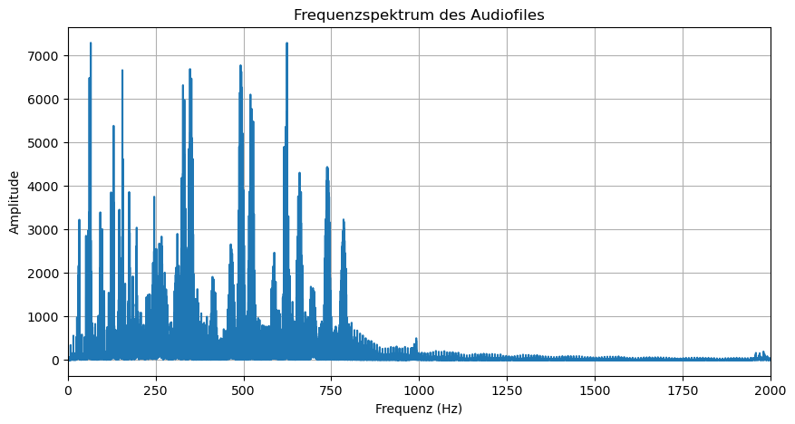

# Audio fingerprinting for plagiarism detection

## Project objective

The project aims to enable artists to assign a unique fingerprint to their audio works. Users can also define how much an audio file can deviate from the original before it is considered plagiarism. The method allows fingerprints to be stored and compared efficiently. In the future, this open-source solution will enable artists to protect their works and detect copies.

---

## Overview and methodology

Each audio signal is first converted to the frequency domain using Fourier transformation and then divided into segments of equal size. The energy (the integral of the amplitudes) is calculated in each segment. These segmented values are stored in the form of fingerprints – implemented by linked lists in which each segment contains important parameters such as start and end frequency, the percentage of the ideal area (*usage_percent*) and the actual integral area.

### Specific steps of audio fingerprinting

1. The audio file is converted into a frequency spectrum of amplitude and frequency.
2. The frequency spectrum is divided into n segments.
3. The total segment area is subtracted from the direct energy integral area.
4. The individual subtracted segment areas are stored in a data structure in the form of a linked list.
5. This linked list is converted into a three-dimensional space (the final fingerprint).
6. Finally, the linked list can be compared with other linked lists and their differences recorded. Characteristic deviations can provide clues as to what caused the deviation (EQ, gain, compression, etc.).

A central aspect of the method is flexible scaling:

- **Local scaling:**  
  Each audio file is normalized based on its own maximum amplitude value, which is robust against internal gain changes.

- **Global scaling:**  
  A uniform, global maximum value enables direct comparison of fingerprints from different audio files.

These approaches make it possible to determine precise differences in spectral area consumption and dynamic properties (such as RMS, crest factor, and delay effects).

---

## Outlook

The next steps include:
- Improving the documentation
- Extensive testing
- Developing a practical implementation (possibly even with its own file type)

The goal is to provide artists with an effective tool to detect plagiarism of their works at an early stage and thus protect their originals.

---

## Copyright disclaimer

The copyright for this project belongs to **Mario von Bassen**.  
The author is a computer scientist and not a mathematician, which is why the mathematical formulations were created with external support.  
The idea of fingerprinting was developed independently, even though research has shown that companies such as Shazam use related techniques – this implementation differs in some details.  
Feedback and suggestions are welcome at [mariovonbassen@gmail.com](mailto:mariovonbassen@gmail.com)


```python
import numpy as np
import matplotlib.pyplot as plt
import librosa
import matplotlib.patches as patches
from scipy.integrate import simpson
from scipy.signal import find_peaks
import json
```

# Frequency spectrum and total energy of an audio file


```python
audio_file = 'test.mp3' 
y, sr = librosa.load(audio_file, sr=None)

fft_result = np.fft.fft(y)
fft_magnitude = np.abs(fft_result)
frequencies = np.fft.fftfreq(len(fft_magnitude), 1/sr)
mask = frequencies >= 0

total_energy = np.sum(fft_magnitude[mask]**2) / len(y)

print(f"Gesamtenergie des Audiosignals: {total_energy:.2f}")

plt.figure(figsize=(10, 5))
plt.plot(frequencies[mask], fft_magnitude[mask])
plt.title('Frequenzspektrum des Audiofiles')
plt.xlabel('Frequenz (Hz)')
plt.ylabel('Amplitude')
plt.xlim(0, 2000) 
plt.grid(True)
plt.show()

```




# Frequency analysis and energy calculation of an audio signal

The result shown is a frequency spectrum that shows how the energy of an audio signal is distributed across different frequencies. The horizontal axis shows the frequencies in hertz (Hz), while the vertical axis shows the amplitudes of the corresponding frequency components.

## 1. Fourier transform

The original audio signal, which is in the time domain, is converted to the frequency domain using the **discrete Fourier transform (DFT)**. The signal is represented as the sum of sine and cosine waves of different frequencies. The mathematical formula is:

$$
X[k] = \sum_{n=0}^{N-1} x[n] \cdot e^{-i\, 2\pi \frac{k \cdot n}{N}}
$$

where:
- \( x[n] \) is the time-discrete audio signal,
- \( N \) represents the total number of signal samples,
- \( X[k] \) is the complex Fourier coefficient for the frequency index \( k \).

To determine the strength of the individual frequency components, the magnitude of the complex Fourier coefficients is calculated:

$$
|X[k]| = \sqrt{\Re(X[k])^2 + \Im(X[k])^2}
$$

Since real signals have a symmetrical spectrum, only the positive frequencies are usually considered.

## 2. Energy calculation (amplitude spectrum)

The total energy of a signal can be calculated using the squared amplitudes. Thanks to **Parseval's theorem**, the following applies:

$$
E = \frac{1}{N}\sum_{n=0}^{N-1} |x[n]|^2 = \sum_{k=0}^{N-1} |X[k]|^2
$$

In the frequency domain, the energy is calculated from the squared amplitudes (magnitudes) of the Fourier coefficients. If only the positive frequencies are considered, the total energy is determined as follows:

$$
\text{Total energy} = \frac{1}{N}\sum_{k \in \text{positive}} |X[k]|^2
$$

## Summary

- **Transformation:** The time-dependent signal is transformed into the frequency domain by representing it as the sum of oscillations of different frequencies.
- **Spectrum analysis:** The amplitudes of the individual frequencies are determined by calculating the magnitudes of the Fourier coefficients.
- **Energy calculation:** By squaring and summing the amplitudes (taking into account the symmetry of the spectrum), a measure of the total energy of the signal is obtained.
- **Visualization:** The frequency spectrum graphically shows the distribution of energy across different frequency ranges, so that dominant frequencies—for example, in the range of interest from 0 to 2000 Hz (range for music pieces)—are immediately recognizable.

## Sources 

https://de.wikipedia.org/wiki/Satz_von_Parseval, https://de.wikipedia.org/wiki/Fourier-Transformation

# Segmentation of the audio file


```python
import numpy as np
import matplotlib.pyplot as plt
import matplotlib.patches as patches
import librosa

audio_file = 'test.mp3' 
y, sr = librosa.load(audio_file, sr=None)

# Berechne die FFT des Audiosignals
fft_result = np.fft.fft(y)
fft_magnitude = np.abs(fft_result)
frequencies = np.fft.fftfreq(len(fft_magnitude), 1/sr)

# Filtere die positiven Frequenzen
mask = frequencies >= 0

# Plot des Frequenzspektrums
plt.figure(figsize=(10, 5))
plt.plot(frequencies[mask], fft_magnitude[mask], label='Frequenzspektrum')
plt.title('Frequenzspektrum des Audiofiles mit Boxen')
plt.xlabel('Frequenz (Hz)')
plt.ylabel('Amplitude')
plt.xlim(0, 2000)

# Anzahl der Boxen, in die die Frequenzachse unterteilt werden soll
n_boxes = 10
x_min, x_max = 0, 2000
box_width = (x_max - x_min) / n_boxes

# Für die Höhe nutzen wir den maximalen Amplitudenwert im betrachteten Frequenzbereich
ax = plt.gca()
max_amplitude = np.max(fft_magnitude[mask])

for i in range(n_boxes):
    box_start = x_min + i * box_width
    # Erzeuge das Rechteck, das das Segment darstellt
    rect = patches.Rectangle((box_start, 0), box_width, max_amplitude,
                             fill=False, edgecolor='red', lw=1, linestyle='--')
    ax.add_patch(rect)
    
    # Füge in jedem Segment einen Text hinzu (z.B. "Segment 1", "Segment 2", ...)
    plt.text(box_start + box_width/2, max_amplitude * 0.9, f"Segment {i+1}",
             horizontalalignment='center', verticalalignment='center',
             color='black', fontsize=8)

plt.legend()
plt.show()

```


    

    


# Divide the frequency spectrum into \( n \) segments

The method presented analyzes an audio signal, transforms it into the frequency domain, and then divides the displayed frequency domain into \( n \) equal segments (boxes). In doing so, the frequency spectrum is visualized and simultaneously broken down mathematically into sub-sections.

## 3. Dividing the frequency range into \( n \) segments

The frequency range under consideration, for example from $$x_{\min} = 0 \text{ Hz to } x_{\max} = 2000$$, is divided into \( n \) equal-sized ranges. The width of a box \( W \) is calculated by:

$$
W = \frac{x_{\max} - x_{\min}}{n}
$$

For each segment $i$ (where $i = 0, 1, 2, \dots, n-1$), the following applies:

$$
x_{\text{start}, i} = x_{\min} + i \cdot W
$$

Thus, the entire frequency range is divided into \( n \) areas, each of which has the same width.


# Description of the `compute_max_segments` function

The function `compute_max_segments` calculates the maximum possible number of segments into which the frequency range of an audio signal can be divided. This is done based on the frequency resolution of the signal. This ensures that the width of each segment is at least equal to the frequency resolution, so that each segment contains enough frequency information to calculate a meaningful integral of the spectrum.

## Mathematical background

**Frequency resolution:**  
After loading the audio signal, the frequency resolution, $\Delta f$, is determined, which specifies how large the frequency spacing between two adjacent points in the spectrum is. It is calculated as follows:

$$
\Delta f = \frac{sr}{N}
$$

Where:
- $sr$ is the sampling rate of the signal,
- $N$ is the number of signal samples.

**Calculation of the maximum possible segments:**
For a defined frequency range from $x_{\text{min}}$ to $x_{\text{max}}$, the maximum possible number of segments is calculated by dividing the total frequency range by the frequency resolution:


$$
max_{segments_{possible}} = \frac{x_{max} - x_{min}}{\Delta f}
$$


The value calculated in this way is then converted to an integer value to obtain the number of meaningful segments.


## Source code of the function

```python
def compute_max_segments(audio_file, x_min, x_max):
    y, sr = librosa.load(audio_file, sr=None)
    delta_f = sr / len(y)
    max_segments_possible = int((x_max - x_min) / delta_f)
    return max_segments_possible
```

## Summary

- **Transformation:** The time-dependent signal is transformed into the frequency domain using DFT.
- **Spectrum analysis:** The amplitude spectrum is obtained by calculating the magnitudes of the Fourier coefficients.
- **Segmentation:** The frequency range (e.g., from 0 to 2000 Hz) is again divided into n equal segments (as above).


# Calculation of segment area and integral area

```python
import numpy as np
import matplotlib.pyplot as plt
import matplotlib.patches as patches
import librosa

audio_file = 'test.mp3' 

y, sr = librosa.load(audio_file, sr=None)

# Berechne die FFT des Audiosignals
fft_result = np.fft.fft(y)
fft_magnitude = np.abs(fft_result)
frequencies = np.fft.fftfreq(len(fft_magnitude), 1/sr)

# Filtere die positiven Frequenzen
mask = frequencies >= 0
freqs = frequencies[mask]
magnitudes = fft_magnitude[mask]

# Plot des Frequenzspektrums
plt.figure(figsize=(10, 5))
plt.title('Frequenzspektrum des Audiofiles mit Boxen')
plt.xlabel('Frequenz (Hz)')
plt.ylabel('Amplitude')
plt.xlim(0, 2000)  # Frequenzbereich anpassen, falls benötigt

# Anzahl der Boxen, in die die Frequenzachse unterteilt werden soll
n_boxes = 10
x_min, x_max = 0, 2000
box_width = (x_max - x_min) / n_boxes

# Berechne den maximalen Amplitudenwert im betrachteten Frequenzbereich
max_amplitude = np.max(magnitudes)

ax = plt.gca()
for i in range(n_boxes):
    box_start = x_min + i * box_width
    box_end = box_start + box_width

    # Rechtecksfläche (ideale Integralfläche)
    rect_area = box_width * max_amplitude
    
    # Filtere die Frequenzwerte im aktuellen Segment
    indices = np.where((freqs >= box_start) & (freqs < box_end))
    freqs_segment = freqs[indices]
    magnitudes_segment = magnitudes[indices]
    
    # Berechne die Fläche unter der Spektrumskurve im Segment (Trapezregel)
    spectrum_area = np.trapz(magnitudes_segment, freqs_segment) if len(freqs_segment) > 1 else 0
    
    # Differenz zwischen Rechtecksfläche und Spektrumfläche
    area_difference = rect_area - spectrum_area

    # Zeichne das gefüllte Rechteck für die ideale Fläche (rot, halbtransparent, hinter)
    rect_patch = patches.Rectangle((box_start, 0), box_width, max_amplitude,
                                   facecolor='red', alpha=0.3,
                                   edgecolor='red', lw=1, linestyle='--', zorder=1)
    ax.add_patch(rect_patch)
    
    # Zeichne die Fläche unter der Spektrumskurve als lightblue vor dem Rechteck (höherer zorder)
    if len(freqs_segment) > 0:
        ax.fill_between(freqs_segment, magnitudes_segment, color='blue', alpha=0.7, zorder=2)
    
    # Zeige die Flächendifferenz als Text in der Box
    plt.text(box_start + box_width/4, max_amplitude * 0.9, f"{area_difference:.1f}",
             color='black', fontsize=8, zorder=3)

plt.legend()
plt.show()

```

    

    


# Description of frequency spectrum segmentation and area calculation

The process described here divides the frequency spectrum of an audio signal into $n$ segments of equal size and compares the ideal rectangular area with the actual integrated area under the spectrum curve for each segment. The area of the curve in the respective frequency interval is determined numerically using the trapezoidal rule and subtracted from the ideal area.

## 4. Area calculation in the segment

## Ideal rectangular area
For each segment, an ideal rectangular area is first defined as a reference. This area is defined as the product of the segment width $W$ and the maximum amplitude $A_{max}$ in the frequency range under consideration:

$$
Area_{rectangle} = W \cdot A_{max}
$$

## Integrated spectrum area
The actual area under the spectrum curve in the respective segment is determined by numerical integration (here using the trapezoidal rule):

$$
Area_{spectrum} = \int_{Start_i}^{End_i} \left| X(f) \right| \, df
$$

Here, $\left| X(f) \right|$ is the amplitude of the spectrum as a function of frequency $f$.

## 5. Calculating the difference

The difference between the ideal rectangle area and the integrated spectrum area indicates how large the area difference is in the respective segment. This difference is calculated as:

$$
\Delta A_i = Area_{rectangle} - Area_{spectrum}
$$

The value $\Delta A_i$ is then displayed as text for each segment in the plot to illustrate the deviation between the ideal and the actual measured energy distribution in the frequency domain.


## Summary

- **Transformation:** The audio signal is transformed into the frequency domain to obtain the amplitude spectrum.
- **Spectrum analysis:** The amplitude spectrum is calculated by determining the magnitudes of the Fourier coefficients.
- **Segmentation:** The frequency range (e.g., from 0 to 2000 Hz) is divided into $n$ equal segments, where the width of each segment is $W = \frac{2000}{n}$.
- **Area calculation:** For each segment, the ideal rectangular area $W \times A_{max}$ is calculated as a reference, and the actual area under the spectrum curve is integrated using the trapezoidal rule.
- **Difference calculation:** The difference $\Delta_i = area_{rectangle} - area_{spectrum}$ shows the area difference in the segment and is displayed in the plot for visualization.


# Fingerprint as a linked list. Creation of an audio fingerprint.

```python
# Parameter
N_SEGMENTS = 10
X_MIN, X_MAX = 0, 2000  # Frequenzbereich in Hz

# Hilfsfunktion zur Berechnung der maximal möglichen Segmente basierend auf der Frequenzauflösung
def compute_max_segments(audio_file, x_min, x_max):
    y, sr = librosa.load(audio_file, sr=None)
    delta_f = sr / len(y)
    max_segments_possible = int((x_max - x_min) / delta_f)
    return max_segments_possible

# Definition der Segment-Node-Klasse für die verkettete Liste
class SegmentNode:
    def __init__(self, index, seg_start, seg_end, usage_percent, actual_area):
        self.index = index                  # Index des Segments
        self.seg_start = seg_start          # Startfrequenz des Segments
        self.seg_end = seg_end              # Endfrequenz des Segments
        self.usage_percent = usage_percent  # Anteil der idealen Fläche, der gefüllt ist (in %)
        self.actual_area = actual_area      # Tatsächliche Integralfläche im Segment
        self.prev = None                    # Zeiger auf das vorherige Segment
        self.next = None                    # Zeiger auf das nächste Segment

    def to_dict(self):
        return {
            "index": self.index,
            "seg_start": self.seg_start,
            "seg_end": self.seg_end,
            "usage_percent": self.usage_percent,
            "actual_area": self.actual_area,
            "prev": self.prev.index if self.prev else None,
            "next": self.next.index if self.next else None
        }

    def __repr__(self):
        return (f"SegmentNode(index={self.index}, start={self.seg_start}, end={self.seg_end}, "
                f"usage_percent={self.usage_percent:.2f}%, actual_area={self.actual_area:.2f}, "
                f"prev={self.prev.index if self.prev else None}, "
                f"next={self.next.index if self.next else None})")

def create_segment_linked_list(audio_file, n_segments, x_min=X_MIN, x_max=X_MAX):
    """
    Das Audiofile wird im Frequenzbereich von x_min bis x_max in n_segments unterteilt.
    Für jedes Segment wird das Integral des Spektrums berechnet.
    Der usage_percent wird als (actual_area / ideal_area)*100 berechnet, wobei
    ideal_area = (Segmentbreite) * (maximale Amplitude des Spektrums) ist.
    """
    y, sr = librosa.load(audio_file, sr=None)
    fft_result = np.fft.rfft(y)
    fft_magnitude = np.abs(fft_result)
    frequencies = np.fft.rfftfreq(len(y), 1/sr)
    
    box_width = (x_max - x_min) / n_segments
    max_amplitude = np.max(fft_magnitude)
    ideal_area = box_width * max_amplitude  # Referenzfläche
    
    head = None
    prev_node = None
    nodes = []
    
    for i in range(n_segments):
        seg_start = x_min + i * box_width
        seg_end = seg_start + box_width
        
        start_idx = np.searchsorted(frequencies, seg_start, side='left')
        end_idx = np.searchsorted(frequencies, seg_end, side='left')
        if end_idx > start_idx:
            actual_area = simpson(y=fft_magnitude[start_idx:end_idx],
                                  x=frequencies[start_idx:end_idx])
        else:
            actual_area = 0
        
        usage_percent = (actual_area / ideal_area) * 100 if ideal_area != 0 else 0
        
        node = SegmentNode(index=i, seg_start=seg_start, seg_end=seg_end,
                           usage_percent=usage_percent, actual_area=actual_area)
        if prev_node is not None:
            prev_node.next = node
            node.prev = prev_node
        else:
            head = node
        prev_node = node
        nodes.append(node)
        
    return head, nodes

def save_fingerprint_to_json(nodes, json_filename):
    """
    Speichert den Fingerprint (verkettete Liste) als JSON.
    """
    fingerprint = [node.to_dict() for node in nodes]
    with open(json_filename, 'w') as f:
        json.dump(fingerprint, f, indent=4)

def load_fingerprint_from_json(json_filename):
    with open(json_filename, 'r') as f:
        fingerprint = json.load(f)
    return fingerprint

def plot_usage_in_frequency(fingerprint):
    """
    Visualisiert die usage_percent-Kurve des Audiofiles im Frequenzbereich.
    Es werden nur die Usage-Werte als Linie mit Punkten und farbige Segmente dargestellt.
    """
    centers = []
    for seg in fingerprint:
        center = (seg["seg_start"] + seg["seg_end"]) / 2
        centers.append(center)
    
    usage_values = [seg["usage_percent"] for seg in fingerprint]
    
    plt.figure(figsize=(12, 6))
    
    # Plot der Usage (%) Kurve mit Punkten
    plt.plot(centers, usage_values, marker='o', linestyle='-', color='blue', label='Flächenverbrauch (%)')
    
    # Farbige Segmente einfügen
    cmap = plt.get_cmap('tab10')  # Colormap mit bis zu 10 unterschiedlichen Farben
    for seg in fingerprint:
        color = cmap(seg["index"] % 10)  # Farbe basierend auf dem Segmentindex
        plt.axvspan(seg["seg_start"], seg["seg_end"], color=color, alpha=0.3)
    
    # Annotations: Anzeige der Usage-Prozentzahl an den Punkten
    for center, usage in zip(centers, usage_values):
        plt.text(center, usage, f"{usage:.2f}%", 
                 horizontalalignment='center', verticalalignment='bottom', 
                 fontsize=9, fontweight='bold', color='black')
    
    plt.title("Gesamter Flächenverbrauch (%) im Frequenzbereich")
    plt.xlabel("Frequenz (Hz)")
    plt.ylabel("Verbrauch in %")
    plt.xlim(X_MIN, X_MAX)
    plt.grid(True)
    plt.legend()
    plt.show()

# --- Hauptprogramm ---
if __name__ == "__main__":
    # Pfad zum Audiofile
    audio_file = "test.mp3"  # Audiofile
    
    # Berechne die maximal mögliche Segmentanzahl
    max_segments_file = 10  # oder compute_max_segments(audio_file, X_MIN, X_MAX)
    
    if N_SEGMENTS > max_segments_file:
        print(f"Warnung: Gewählte Anzahl an Segmenten ({N_SEGMENTS}) überschreitet die maximal mögliche Anzahl ({max_segments_file}).")
        N_SEGMENTS = max_segments_file
        print(f"Es werden {N_SEGMENTS} Segmente verwendet.")
    
    # Erzeuge den Fingerprint (verkettete Liste) für das Audiofile
    head, nodes = create_segment_linked_list(audio_file, N_SEGMENTS, X_MIN, X_MAX)
    
    # Fingerprint als JSON speichern
    save_fingerprint_to_json(nodes, "fingerprint.json")
    
    fingerprint = [node.to_dict() for node in nodes]
    
    plot_usage_in_frequency(fingerprint)

```


    

    


# Creating a linked list to store the integral areas per segment

This process divides the frequency spectrum of an audio signal into several segments and stores important information for each segment in an element of a linked list. Both mathematical calculations and data structures are used to create a “fingerprint” of the spectrum.

## Structure of a list element (SegmentNode)

Each element of the linked list contains the following information:

- **index:**  
  The sequential index of the segment (e.g., $0, 1, 2, \dots$).

- **seg_start:**  
  The start frequency of the segment (e.g., $x_{\min} + i \cdot W$).

- **seg_end:**  
  The end frequency of the segment (i.e., ${seg\_start} + W$).

- **usage_percent:**  
  The percentage of the ideal area covered by the actual area under the spectrum curve. This indicates how “full” the segment is compared to the maximum.

- **actual_area:**  
  The calculated integral area under the spectrum curve for the respective segment.

- **prev & next:**  
  Pointers (references) to the previous and next elements of the list. This allows the list to be traversed (linked list).


### Example structure of a list element

```python
class SegmentNode:
    def __init__(self, index, seg_start, seg_end, usage_percent, actual_area):
        self.index = index                  # Index des Segments
        self.seg_start = seg_start          # Startfrequenz des Segments
        self.seg_end = seg_end              # Endfrequenz des Segments
        self.usage_percent = usage_percent  # Prozentualer Anteil der idealen Fläche, die gefüllt ist
        self.actual_area = actual_area      # Tatsächliche Integralfläche im Segment
        self.prev = None                    # Zeiger auf das vorherige Segment
        self.next = None                    # Zeiger auf das nächste Segment
```


# Verification of the fingerprint ~ Audio file analysis


```python
# Parameter
LOCAL_THRESHOLD = 1.0      # für Boost/Cut (in %)
NEW_FILE_THRESHOLD = 5.0  # wenn die Abweichung > 50% liegt, dann "Neues Audiofile"
x_min, x_max = 0, 2000     # Frequenzbereich in Hz

# Hilfsfunktion zur Berechnung der maximal möglichen Boxen basierend auf der Frequenzauflösung
def compute_max_segments(audio_file, x_min, x_max):
    y, sr = librosa.load(audio_file, sr=None)
    delta_f = sr / len(y)
    max_segments_possible = int((x_max - x_min) / delta_f)
    return max_segments_possible

# Datenstruktur für ein Box-Element in der verketteten Liste (nur für das Original)
class BoxNode:
    def __init__(self, index, box_start, box_end, orig_integral):
        self.index = index          # Index des Segments
        self.box_start = box_start  # Startfrequenz des Segments
        self.box_end = box_end      # Endfrequenz des Segments
        self.orig_integral = orig_integral  # Integral (Fläche) des Spektrums im Segment
        self.prev = None            # Verweis auf das vorherige Segment
        self.next = None            # Verweis auf das nächste Segment

    def __repr__(self):
        prev_index = self.prev.index if self.prev else None
        next_index = self.next.index if self.next else None
        return (f"BoxNode(index={self.index}, start={self.box_start}, end={self.box_end}, "
                f"orig_integral={self.orig_integral:.1f}, prev={prev_index}, next={next_index})")

def guess_local_effect(deviation, local_threshold=LOCAL_THRESHOLD, new_file_threshold=NEW_FILE_THRESHOLD):
    if abs(deviation) > new_file_threshold:
        return "Neues Audiofile"
    elif deviation > local_threshold:
        return "Cut"
    elif deviation < local_threshold:
        return "Boost"
    else:
        return "Keine Änderung"

def create_box_linked_list(audio_file, n_boxes, x_min=0, x_max=2000):
    """
    Berechnet pro Segment das Integral (Fläche) des Spektrums und erzeugt eine verkettete Liste von BoxNodes.
    """
    y, sr = librosa.load(audio_file, sr=None)
    fft_result = np.fft.rfft(y)
    fft_magnitude = np.abs(fft_result)
    frequencies_pos = np.fft.rfftfreq(len(y), 1/sr)
    
    box_width = (x_max - x_min) / n_boxes
    # Ideale Boxfläche: Boxbreite * maximale Amplitude im Spektrum
    max_amplitude = np.max(fft_magnitude)
    box_area = box_width * max_amplitude  
    
    head = None
    prev_node = None
    nodes = []
    
    for i in range(n_boxes):
        seg_start = x_min + i * box_width
        seg_end = seg_start + box_width
        
        start_idx = np.searchsorted(frequencies_pos, seg_start, side='left')
        end_idx = np.searchsorted(frequencies_pos, seg_end, side='left')
        integral = simpson(fft_magnitude[start_idx:end_idx], x=frequencies_pos[start_idx:end_idx]) if end_idx > start_idx else 0
        
        node = BoxNode(index=i, box_start=seg_start, box_end=seg_end, orig_integral=integral)
        if prev_node is not None:
            prev_node.next = node
            node.prev = prev_node
        else:
            head = node
        prev_node = node
        nodes.append(node)
        
    return head, nodes, box_area, frequencies_pos, fft_magnitude

def compute_new_integrals(audio_file, n_boxes, x_min=0, x_max=2000):
    """
    Berechnet pro Segment die integrale Fläche (Fläche des Spektrums) für das neue Audiofile.
    """
    y, sr = librosa.load(audio_file, sr=None)
    fft_result = np.fft.rfft(y)
    fft_magnitude = np.abs(fft_result)
    frequencies_pos = np.fft.rfftfreq(len(y), 1/sr)
    
    box_width = (x_max - x_min) / n_boxes
    new_integrals = []
    
    for i in range(n_boxes):
        seg_start = x_min + i * box_width
        seg_end = seg_start + box_width
        
        start_idx = np.searchsorted(frequencies_pos, seg_start, side='left')
        end_idx = np.searchsorted(frequencies_pos, seg_end, side='left')
        integral = simpson(fft_magnitude[start_idx:end_idx], x=frequencies_pos[start_idx:end_idx]) if end_idx > start_idx else 0
        new_integrals.append(integral)
        
    return new_integrals, frequencies_pos, fft_magnitude

# === Hauptprogramm ===

original_audio = "test.mp3"   # Original-Audiofile
new_audio = "low_eq.mp3"         # Neues Audiofile

# Dynamische Anpassung: Berechne die maximal mögliche Anzahl an Boxen anhand des Frequenzspektrums
#max_boxes_orig = compute_max_segments(original_audio, x_min, x_max)
#max_boxes_new = compute_max_segments(new_audio, x_min, x_max)

max_boxes_orig = 10
max_boxes_new = 10

n_boxes = min(max_boxes_orig, max_boxes_new)

# 1) Berechne integrale Flächen pro Segment für das Original
head, nodes, box_area, freq_orig, fft_mag_orig = create_box_linked_list(original_audio, n_boxes, x_min, x_max)

# 2) Berechne integrale Flächen pro Segment für das neue Audiofile
new_integrals, freq_new, fft_mag_new = compute_new_integrals(new_audio, n_boxes, x_min, x_max)

# 3) Plot: Frequenzspektren, Boxen und farbige Hintergründe zeichnen
plt.figure(figsize=(12, 6))
ax = plt.gca()

# Farbliche Hintergründe (Bass, Mitten, Höhen)
bass_end = x_min + (x_max - x_min) / 3
mid_end = x_min + 2 * (x_max - x_min) / 3
ax.axvspan(x_min, bass_end, color='cyan', alpha=0.15, label='Bass')
ax.axvspan(bass_end, mid_end, color='magenta', alpha=0.15, label='Mitten')
ax.axvspan(mid_end, x_max, color='yellow', alpha=0.15, label='Höhen')

# Plot der Frequenzspektren
ax.plot(freq_orig, fft_mag_orig, label='Originales Spektrum', color='red', alpha=0.7)
ax.plot(freq_new, fft_mag_new, label='Neues Spektrum', color='blue', alpha=0.7)

# 4) Vergleich der prozentualen Nutzung der idealen Boxfläche pro Segment
local_effects = []
deviations = []
weights = []
segment_centers = []  # Mittlere Frequenz jedes Segments
usage_orig_list = []
usage_new_list = []

max_amplitude = max(np.max(fft_mag_orig), np.max(fft_mag_new))

for i, node in enumerate(nodes):
    # Berechne den Nutzungsanteil (in %) des Originals und des neuen Files
    usage_orig = (node.orig_integral / box_area) * 100
    usage_new = (new_integrals[i] / box_area) * 100
    
    usage_orig_list.append(usage_orig)
    usage_new_list.append(usage_new)
    
    # Differenz der Nutzungsanteile als Absolutwert
    deviation_usage = abs(usage_new - usage_orig)
    deviations.append(deviation_usage)
    
    local_eff = guess_local_effect(deviation_usage)
    local_effects.append(local_eff)
    
    # Gewichtung: Originalintegral (Segmente mit mehr Fläche haben höhere Gewichtung)
    weights.append(node.orig_integral)
    
    # Mittlere Frequenz des Segments
    center = node.box_start + (node.box_end - node.box_start) / 2
    segment_centers.append(center)
    
    # Zeichne die Boxen (Rechtecke) für das Segment
    rect = patches.Rectangle((node.box_start, 0), (node.box_end - node.box_start), max_amplitude,
                             fill=False, edgecolor='black', lw=1, linestyle='--')
    ax.add_patch(rect)
    
    # Textlabels: Original-, Neue-Nutzung und Differenz
    text_x = center
    ax.text(text_x, max_amplitude*0.85, f"O: {usage_orig:.1f}%", ha='center', va='center', color='red', fontsize=8)
    ax.text(text_x, max_amplitude*0.70, f"N: {usage_new:.1f}%", ha='center', va='center', color='blue', fontsize=8)
    ax.text(text_x, max_amplitude*0.55, f"Diff: {deviation_usage:.1f}%", ha='center', va='center', color='green', fontsize=8)

# Bestimme den Segmentindex mit der höchsten Nutzung (Original und Neu)
max_usage_orig = max(usage_orig_list)
max_usage_new = max(usage_new_list)
max_index_orig = usage_orig_list.index(max_usage_orig)
max_index_new = usage_new_list.index(max_usage_new)

# Markiere das Segment mit der höchsten Nutzung im Plot
highlight_rect_orig = patches.Rectangle((nodes[max_index_orig].box_start, 0), 
                                          (nodes[max_index_orig].box_end - nodes[max_index_orig].box_start), 
                                          max_amplitude,
                                          fill=False, edgecolor='darkred', linewidth=3, linestyle='--')
ax.add_patch(highlight_rect_orig)
ax.text(nodes[max_index_orig].box_start + (nodes[max_index_orig].box_end - nodes[max_index_orig].box_start)/2, 
        max_amplitude*0.95, "Max Orig", ha='center', va='center', color='darkred', fontsize=10, fontweight='bold')

highlight_rect_new = patches.Rectangle((nodes[max_index_new].box_start, 0), 
                                         (nodes[max_index_new].box_end - nodes[max_index_new].box_start), 
                                         max_amplitude,
                                         fill=False, edgecolor='darkblue', linewidth=3, linestyle='--')
ax.add_patch(highlight_rect_new)
ax.text(nodes[max_index_new].box_start + (nodes[max_index_new].box_end - nodes[max_index_new].box_start)/2, 
        max_amplitude*0.90, "Max Neu", ha='center', va='center', color='darkblue', fontsize=10, fontweight='bold')

# Berechnung des gewichteten Durchschnitts der Abweichungen (per Segment)
weighted_avg_deviation = np.sum(np.array(deviations) * np.array(weights)) / (np.sum(weights) + 1e-6)
ax.text(x_min + (x_max - x_min)*0.5, max_amplitude*0.95,
        f'Gewichtete Durchschnittliche Differenz: {weighted_avg_deviation:.2f}%',
        ha='center', va='center', color='black', fontsize=10,
        bbox=dict(facecolor='white', alpha=0.5))

# Berechnung des ungewichteten (einfachen) globalen Durchschnitts der Abweichungen
global_mean_deviation = np.mean(deviations)
ax.text(x_min + (x_max - x_min)*0.5, max_amplitude*0.90,
        f'Ungewichteter Durchschnitt: {global_mean_deviation:.2f}%',
        ha='center', va='center', color='black', fontsize=10,
        bbox=dict(facecolor='white', alpha=0.5))

print(f"\nGewichtete Durchschnittliche Differenz: {weighted_avg_deviation:.2f}%")
print(f"Globaler Durchschnitt (ungewichtetes Mittel): {global_mean_deviation:.2f}%")

# Globale Effektabschätzung
def guess_effect_from_boxes(deviations, weights):
    weighted_avg = np.sum(np.array(deviations) * np.array(weights)) / np.sum(weights)
    
    n = len(deviations)
    n_third = n // 3
    low_region = deviations[:n_third]
    mid_region = deviations[n_third:2*n_third]
    high_region = deviations[2*n_third:]
    
    mean_low = np.mean(low_region)
    mean_mid = np.mean(mid_region)
    mean_high = np.mean(high_region)
    
    if (abs(mean_low - mean_mid) / (abs(mean_mid)+1e-6) < 0.05 and 
        abs(mean_mid - mean_high) / (abs(mean_high)+1e-6) < 0.05):
        if weighted_avg < 0:
            effect = "Gain-Anhebung"
        else:
            effect = "Gain-Reduktion"
    elif mean_low > mean_mid and mean_low > mean_high:
        effect = "Boost im Bassbereich"
    elif mean_high > mean_mid and mean_high > mean_low:
        effect = "Boost im Hochtonbereich"
    elif mean_mid > mean_low and mean_mid > mean_high:
        effect = "Boost im Mittelfeld oder Kompression"
    else:
        effect = "Kombinierter Effekt oder unklar"
    
    return {
        "weighted_avg_deviation": weighted_avg,
        "global_mean_deviation": np.mean(deviations),
        "mean_low": mean_low,
        "mean_mid": mean_mid,
        "mean_high": mean_high,
        "predicted_effect": effect
    }

effect_info = guess_effect_from_boxes(deviations, weights)
global_effect_text = f"Globaler Effekt:\n{effect_info['predicted_effect']}"
ax.text(x_max - 10, max_amplitude * 0.9, global_effect_text,
        fontsize=9, color='black', va='top', ha='right',
        bbox=dict(facecolor='white', alpha=0.7))

# Berechnung des gewichteten Mittelwerts und der Standardabweichung der Segmentmittelwerte (Frequenz)
weighted_mean_freq = np.sum(np.array(segment_centers) * np.array(weights)) / (np.sum(weights) + 1e-6)
weighted_var_freq = np.sum(np.array(weights) * (np.array(segment_centers) - weighted_mean_freq)**2) / (np.sum(weights) + 1e-6)
weighted_std_freq = np.sqrt(weighted_var_freq)
# Frequenzbereich, der ca. 80% der Amplituden abdeckt (±1.28155 Std)
freq_lower = weighted_mean_freq - 1.28155 * weighted_std_freq
freq_upper = weighted_mean_freq + 1.28155 * weighted_std_freq

# Zeichne vertikale Linien zur Markierung des 80%-Frequenzbereichs
ax.axvline(freq_lower, color='purple', linestyle='--', linewidth=2, label=f'80%-Bereich: {freq_lower:.0f} Hz')
ax.axvline(freq_upper, color='purple', linestyle='--', linewidth=2, label=f'{freq_upper:.0f} Hz')

# Optionale Darstellung einer gewichteten Normalverteilung (über Frequenz) als Kurve
x_vals = np.linspace(x_min, x_max, 500)
gauss = 0.2 * max_amplitude * np.exp(-((x_vals - weighted_mean_freq)**2) / (2 * weighted_std_freq**2))
ax.plot(x_vals, gauss, color='k', linestyle='--', label='Gewichtete Normalverteilung')

plt.title('Vergleich: Original (rot) vs. Neu (blau)')
plt.xlabel('Frequenz (Hz)')
plt.ylabel('Amplitude / Nutzung in %')
plt.xlim(x_min, x_max)
plt.legend(loc='upper right')
plt.show()

print("\nGlobaler Audioeffekt basierend auf Nutzungsanteilen der Spektren:")
print(f"Gewichtete Durchschnittliche Differenz: {weighted_avg_deviation:.2f}%")
print(f"Vermuteter globaler Effekt: {effect_info['predicted_effect']}\n")
print(f"80%-Frequenzbereich: {freq_lower:.0f} Hz bis {freq_upper:.0f} Hz\n")

# Dynamische Analyse (wie gehabt)
def analyze_dynamic_effects(original_audio, new_audio):
    y_orig, sr_orig = librosa.load(original_audio, sr=None)
    y_new, sr_new = librosa.load(new_audio, sr=None)
    
    if sr_orig != sr_new:
        raise ValueError("Die Samplingraten der Audiofiles stimmen nicht überein!")
    
    def compute_dynamic_measures(y):
        rms = np.sqrt(np.mean(y**2))
        peak = np.max(np.abs(y))
        crest = peak / (rms + 1e-6)
        return rms, peak, crest
    
    rms_orig, peak_orig, crest_orig = compute_dynamic_measures(y_orig)
    rms_new, peak_new, crest_new = compute_dynamic_measures(y_new)
    
    rms_change = (rms_new - rms_orig) / (rms_orig + 1e-6)
    crest_change = (crest_new - crest_orig) / (crest_orig + 1e-6)
    
    fft_y_new = np.fft.rfft(y_new)
    power_spectrum = np.abs(fft_y_new)**2
    autocorr = np.fft.irfft(power_spectrum)
    
    min_lag_samples = int(0.01 * sr_new)
    peaks, _ = find_peaks(autocorr, height=0.3 * np.max(autocorr))
    valid_peaks = peaks[peaks >= min_lag_samples]
    delay_indicator = len(valid_peaks)
    
    if crest_change < -0.2:
        dynamic_effect = "Kompression (verringerter Dynamikumfang)"
    elif peak_new > 1.1 * peak_orig:
        dynamic_effect = "Distortion (Clipping/erhöhte Spitzen)"
    elif delay_indicator > 200:
        dynamic_effect = "Delay (periodische Wiederholungen)"
    elif rms_change > 0.2:
        dynamic_effect = "Gain-Erhöhung (Lautstärke erhöht)"
    elif rms_change < -0.2:
        dynamic_effect = "Gain-Reduktion (Lautstärke reduziert)"
    else:
        dynamic_effect = "Kein eindeutiger dynamischer Effekt"
    
    return {
        "rms_orig": rms_orig,
        "rms_new": rms_new,
        "crest_orig": crest_orig,
        "crest_new": crest_new,
        "rms_change": rms_change,
        "crest_change": crest_change,
        "delay_indicator": delay_indicator,
        "predicted_dynamic_effect": dynamic_effect
    }

dynamic_info = analyze_dynamic_effects(original_audio, new_audio)
print("Analyse der dynamischen Kennzahlen:")
print(f"Original RMS: {dynamic_info['rms_orig']:.4f}, Neues RMS: {dynamic_info['rms_new']:.4f}, Änderung: {dynamic_info['rms_change']*100:.2f}%")
print(f"Original Crest-Factor: {dynamic_info['crest_orig']:.2f}, Neuer Crest-Factor: {dynamic_info['crest_new']:.2f}, Änderung: {dynamic_info['crest_change']*100:.2f}%")
print(f"Delay-Indikator (Anzahl signifikanter Peaks): {dynamic_info['delay_indicator']}")
print(f"Vermuteter dynamischer Effekt: {dynamic_info['predicted_dynamic_effect']}")


```

    

    

Weighted average difference: 4.05% and global average (unweighted average): 1.72%
    
Global audio effect based on spectrum usage shares:
Weighted average difference: 4.05%
Presumed global effect: Boost in the bass range

80% frequency range: 91 Hz to 758 Hz

Analysis of dynamic parameters:
Original RMS: 0.0908, New RMS: 0.1658, Change: 82.55%
Original Crest Factor: 4.69, New Crest Factor: 3.75, Change: -20.17%
Delay indicator (number of significant peaks): 8
Presumed dynamic effect: Compression (reduced dynamic range)


# Audio file analysis

This notebook compares two audio files – an original and a new version. Various mathematical methods are used, which can be roughly divided into the following areas:

---

## Integration to determine energy

- **Numerical integration:**
Within each frequency segment, the integral (the area under the spectral curve) is calculated. A Simpson's rule is used for this, which is an efficient method for the numerical approximation of integrals.
*Mathematically:*  
  $\int_\approx \int_{f_1}^{f_2} \left| X(f) \right| \, df$

- **Comparison of energy shares:**  
  The calculated integrals per segment are expressed as a percentage relative to the ideal box area, which quantifies the “usage share” of the frequency band.

---

## Comparison and weighting of spectra

- **Deviation calculation:**  
  For each segment, the percentage difference between the usage shares of the original and new audio is calculated:
  $Deviation = \left| \frac{Usage_{new} - Usage_{orig}}{Box area} \right| \times 100\%$

- **Classification of effects:**
Based on predefined thresholds, the deviations are classified into different effects (e.g., “boost,” “cut,” or “new audio file”).

- **Weighted averages:**  
  The deviations are additionally weighted, with segments with higher energy (larger integral) having a greater influence on the overall average. This provides a more robust global assessment.

---

## Dynamic analysis in the time domain

- **Calculation of RMS, peak, and crest factor:**
In addition to frequency analysis, dynamic behavior is also examined.  
  - **RMS (Root Mean Square):** Indicates the average energy content of the signal.  
    $RMS = \sqrt{\frac{1}{N}\sum_{n=0}^{N-1} x(n)^2}$
- **Peak:** The maximum amplitude value in the signal.
  - **Crest factor:** The ratio of peak to RMS, which allows conclusions to be drawn about the signal peaks.

- **Autocorrelation for delay detection:**  
  By calculating the autocorrelation function of the signal, periodic patterns (possibly indications of delay effects) are identified.

- **Comparison of dynamic metrics:**  
  Changes in these metrics (RMS, crest, peaks) between the original and the new audio provide information about whether any effects such as compression, clipping, or gain changes are present.


---

## Summary

Overall, the code combines:
- **Spectral analysis** (Fourier transform and integration) to quantify the frequency content of the audio signals.
- **Segmentation** into frequency bands to capture local differences in the frequency spectrum.
- **Comparative analyses** (weighted and unweighted averages of the deviations) to identify global effects.
- **Dynamic analysis** in the time domain to detect changes in signal strength and dynamics.

These mathematical methods make it possible to determine in a differentiated manner how the new audio behaves in comparison to the original – whether through EQ adjustments (boost/cut) or dynamic changes (e.g., compression or distortion).

# Compare two audio files using fingerprints.


```python
# --- Parameter ---
N_SEGMENTS = 10
X_MIN, X_MAX = 0, 2000  # Frequenzbereich in Hz

def compute_max_segments(audio_file, x_min, x_max):
    y, sr = librosa.load(audio_file, sr=None)
    delta_f = sr / len(y)
    max_segments_possible = int((x_max - x_min) / delta_f)
    return max_segments_possible

# Definition der Segment-Node-Klasse für die verkettete Liste
class SegmentNode:
    def __init__(self, index, seg_start, seg_end, usage_percent, actual_area):
        self.index = index                  # Index des Segments
        self.seg_start = seg_start          # Startfrequenz des Segments
        self.seg_end = seg_end              # Endfrequenz des Segments
        self.usage_percent = usage_percent  # Anteil der idealen Fläche, der gefüllt ist (in %)
        self.actual_area = actual_area      # Tatsächliche Integralfläche im Segment
        self.prev = None                    # Zeiger auf das vorherige Segment
        self.next = None                    # Zeiger auf das nächste Segment

    def to_dict(self):
        return {
            "index": self.index,
            "seg_start": self.seg_start,
            "seg_end": self.seg_end,
            "usage_percent": self.usage_percent,
            "actual_area": self.actual_area,
            "prev": self.prev.index if self.prev else None,
            "next": self.next.index if self.next else None
        }

    def __repr__(self):
        return (f"SegmentNode(index={self.index}, start={self.seg_start}, end={self.seg_end}, "
                f"usage_percent={self.usage_percent:.2f}%, actual_area={self.actual_area:.2f}, "
                f"prev={self.prev.index if self.prev else None}, "
                f"next={self.next.index if self.next else None})")

def create_segment_linked_list(audio_file, n_segments, x_min=X_MIN, x_max=X_MAX, global_max_amp=None):
    y, sr = librosa.load(audio_file, sr=None)
    fft_result = np.fft.rfft(y)
    fft_magnitude = np.abs(fft_result)
    frequencies = np.fft.rfftfreq(len(y), 1/sr)
    
    box_width = (x_max - x_min) / n_segments
    # Verwende global_max_amp, falls angegeben, ansonsten berechne den lokalen Maximalwert
    if global_max_amp is None:
        max_amplitude = np.max(fft_magnitude)
    else:
        max_amplitude = global_max_amp
    ideal_area = box_width * max_amplitude  # Bezugsfläche
    
    head = None
    prev_node = None
    nodes = []
    
    for i in range(n_segments):
        seg_start = x_min + i * box_width
        seg_end = seg_start + box_width
        
        start_idx = np.searchsorted(frequencies, seg_start, side='left')
        end_idx = np.searchsorted(frequencies, seg_end, side='left')
        if end_idx > start_idx:
            actual_area = simpson(fft_magnitude[start_idx:end_idx], x=frequencies[start_idx:end_idx])
        else:
            actual_area = 0
        
        usage_percent = (actual_area / ideal_area) * 100 if ideal_area != 0 else 0
        
        node = SegmentNode(index=i, seg_start=seg_start, seg_end=seg_end,
                           usage_percent=usage_percent, actual_area=actual_area)
        if prev_node is not None:
            prev_node.next = node
            node.prev = prev_node
        else:
            head = node
        prev_node = node
        nodes.append(node)
        
    return head, nodes

def save_fingerprint_to_json(nodes, json_filename):
    """
    Speichert den Fingerprint (verkettete Liste) als JSON.
    """
    fingerprint = [node.to_dict() for node in nodes]
    with open(json_filename, 'w') as f:
        json.dump(fingerprint, f, indent=4)
   
def load_fingerprint_from_json(json_filename):
    with open(json_filename, 'r') as f:
        fingerprint = json.load(f)
    return fingerprint

def compute_deviations_and_weights(fingerprint1, fingerprint2):
    """
    Berechnet pro Segment die absolute Differenz der usage_percent beider Audiofiles.
    Als Gewicht wird der Durchschnitt der tatsächlichen Flächen (actual_area) verwendet.
    """
    deviations = []
    weights = []
    for seg1, seg2 in zip(fingerprint1, fingerprint2):
        deviation = abs(seg1["usage_percent"] - seg2["usage_percent"])
        weight = (seg1["actual_area"] + seg2["actual_area"]) / 2
        deviations.append(deviation)
        weights.append(weight)
    return np.array(deviations), np.array(weights)

def compute_global_weighted_deviation(deviations, weights):
    """
    Berechnet den global gewichteten Durchschnitt der Differenzen sowie die Standardabweichung.
    Segmente mit höherem Energiegehalt (actual_area) fließen stärker in die Berechnung ein.
    """
    weighted_avg = np.sum(deviations * weights) / np.sum(weights)
    weighted_var = np.sum(weights * (deviations - weighted_avg)**2) / np.sum(weights)
    weighted_std = np.sqrt(weighted_var)
    return weighted_avg, weighted_std

def plot_deviations_in_frequency(fingerprint1, fingerprint2, deviations, global_avg, global_std, 
                                 plot_title="Vergleich der Nutzung im Frequenzbereich", ax=None):
    """
    Visualisiert die usage_percent-Kurven beider Audiofiles und die pro Segment berechneten Abweichungen
    im Frequenzbereich. Zusätzlich werden die einzelnen Segment-Boxen eingezeichnet.
    
    Falls ein Achsenobjekt 'ax' übergeben wird, wird der Plot in diesem gezeichnet. Andernfalls wird ein
    neues Figure-Objekt erzeugt.
    """
    if ax is None:
        fig, ax = plt.subplots(figsize=(12, 6))
    
    centers = []
    widths = []
    for seg in fingerprint1:
        center = (seg["seg_start"] + seg["seg_end"]) / 2
        width = seg["seg_end"] - seg["seg_start"]
        centers.append(center)
        widths.append(width)
    
    usage_orig = [seg["usage_percent"] for seg in fingerprint1]
    usage_new = [seg["usage_percent"] for seg in fingerprint2]
    
    # Hintergrund: typische Frequenzbereiche (Bass, Mitten, Höhen)
    bass_end = X_MIN + (X_MAX - X_MIN) / 3
    mid_end = X_MIN + 2 * (X_MAX - X_MIN) / 3
    ax.axvspan(X_MIN, bass_end, color='cyan', alpha=0.15, label='Bass')
    ax.axvspan(bass_end, mid_end, color='magenta', alpha=0.15, label='Mitten')
    ax.axvspan(mid_end, X_MAX, color='yellow', alpha=0.15, label='Höhen')
    
    ax.plot(centers, usage_orig, marker='o', linestyle='-', color='blue', label='Originaler Flächenverbrauch (%)')
    ax.plot(centers, usage_new, marker='s', linestyle='--', color='green', label='Neuer Flächenverbrauch (%)')
    ax.bar(centers, deviations, width=widths, color='gray', alpha=0.5, edgecolor='black', label='Abweichung (%)')
    
    # Einzeichnen der Segment-Boxen als Rechtecke
    ymin, ymax = ax.get_ylim()  # aktuelle y-Achsen-Grenzen
    for seg in fingerprint1:
        rect = patches.Rectangle((seg["seg_start"], ymin),
                                 seg["seg_end"] - seg["seg_start"],
                                 ymax - ymin,
                                 linewidth=1,
                                 edgecolor='black',
                                 facecolor='none',
                                 linestyle='--')
        ax.add_patch(rect)
    
    # Anzeige des global gewichteten Durchschnitts und der Standardabweichung
    ax.text(0.05, 0.95, f'Gewichteter Durchschnitt: {global_avg:.2f}%\nGewichtete Std: {global_std:.2f}%', 
            transform=ax.transAxes, fontsize=12, verticalalignment='top',
            bbox=dict(boxstyle='round', facecolor='wheat', alpha=0.5))
    
    ax.set_title(plot_title)
    ax.set_xlabel("Frequenz (Hz)")
    ax.set_ylabel("Usage in % / Abweichung in %")
    ax.set_xlim(X_MIN, X_MAX)
    ax.legend()

if __name__ == "__main__":
    # Pfade zu den Audiofiles (Original und Vergleich)
    audio_file1 = "test.mp3"      # Original-Audiofile
    audio_file2 = "compress.mp3"  # Vergleichs-Audiofile

    # --- 1) Fingerabdrücke mit lokaler (separater) Skalierung ---
    head_local1, nodes_local1 = create_segment_linked_list(audio_file1, N_SEGMENTS, X_MIN, X_MAX, global_max_amp=None)
    head_local2, nodes_local2 = create_segment_linked_list(audio_file2, N_SEGMENTS, X_MIN, X_MAX, global_max_amp=None)

    # Speicherung als "local" Fingerprints
    save_fingerprint_to_json(nodes_local1, "fingerprint_local1.json")
    save_fingerprint_to_json(nodes_local2, "fingerprint_local2.json")
    fingerprint_local1 = [node.to_dict() for node in nodes_local1]
    fingerprint_local2 = [node.to_dict() for node in nodes_local2]

    deviations_local, weights_local = compute_deviations_and_weights(fingerprint_local1, fingerprint_local2)
    weighted_avg_deviation_local, weighted_std_deviation_local = compute_global_weighted_deviation(deviations_local, weights_local)

    # --- 2) Fingerabdrücke mit global einheitlicher Skalierung ---
    y1, sr1 = librosa.load(audio_file1, sr=None)
    fft_magnitude1 = np.abs(np.fft.rfft(y1))
    y2, sr2 = librosa.load(audio_file2, sr=None)
    fft_magnitude2 = np.abs(np.fft.rfft(y2))
    global_max_amp = max(np.max(fft_magnitude1), np.max(fft_magnitude2))
    
    head_global1, nodes_global1 = create_segment_linked_list(audio_file1, N_SEGMENTS, X_MIN, X_MAX, global_max_amp=global_max_amp)
    head_global2, nodes_global2 = create_segment_linked_list(audio_file2, N_SEGMENTS, X_MIN, X_MAX, global_max_amp=global_max_amp)
    
    # Speicherung als "global" Fingerprints
    save_fingerprint_to_json(nodes_global1, "fingerprint_global1.json")
    save_fingerprint_to_json(nodes_global2, "fingerprint_global2.json")
    fingerprint_global1 = [node.to_dict() for node in nodes_global1]
    fingerprint_global2 = [node.to_dict() for node in nodes_global2]

    deviations_global, weights_global = compute_deviations_and_weights(fingerprint_global1, fingerprint_global2)
    weighted_avg_deviation_global, weighted_std_deviation_global = compute_global_weighted_deviation(deviations_global, weights_global)
    
    # Erzeugen eines gemeinsamen Figures mit zwei Subplots (nebeneinander)
    fig, (ax1, ax2) = plt.subplots(1, 2, figsize=(24, 6))
    
    plot_deviations_in_frequency(fingerprint_local1, fingerprint_local2, deviations_local,
                                 weighted_avg_deviation_local, weighted_std_deviation_local,
                                 plot_title="Abweichung mit lokaler Skalierung", ax=ax1)
    
    plot_deviations_in_frequency(fingerprint_global1, fingerprint_global2, deviations_global,
                                 weighted_avg_deviation_global, weighted_std_deviation_global,
                                 plot_title="Abweichung mit globaler Skalierung", ax=ax2)
    
    plt.tight_layout()
    plt.show()

```


    

    


# Scaling in fingerprint analysis: Local vs. uniform (global) scaling

In this section of code, the frequency range of an audio signal is divided into a fixed number of segments in order to calculate the “area consumption” (the integral of the spectrum) from each segment. The measurement results are normalized (scaled) – i.e., the ideal reference area is calculated – in two alternative ways. This scaling decision has significant advantages and disadvantages:

---

## Local scaling

**Description:**
- **Calculation:**
In local scaling, the maximum amplitude value of the spectrum is calculated separately for each audio file.
- **Normalization basis:**
This is used to determine the ideal area per segment (segment width × local maximum value), which is used as a basis for the actual area consumption.  
- **Method:**  
  Each fingerprint (i.e., the spectrum in segments) is thus normalized relative to the dynamics of the respective audio file.

**Advantages:**  
- **Robustness against gain changes:**  
  Changes in volume or gain adjustments within an audio file do not alter the internal ratios, as each file has its own normalization basis.
- **Dynamic range capture:**  
  The internal dynamics of the audio are well represented, as the scaling is linked to the individual maximum value.

**Disadvantages:**  
- **Comparability:**  
  Since each file is normalized independently, direct comparison between different audio files is difficult.  
- **Evidence of manipulation:**  
  Changes that occur in the relative values could also be due in part to different dynamics and not only to changes in content.

---

## Uniform scaling

**Description:**
- **Calculation:**
A global maximum value (global_max_amp) is used here, which is determined from several audio files (e.g., the original and the comparison).  
- **Normalization basis:**  
  This fixed reference value is used to calculate the ideal area for all files uniformly.
- **Method:**  
  Both fingerprints are scaled to the same reference, which enables a direct, absolute comparison.

**Advantages:**
- **Direct comparison:**  
  Since all files are normalized using the same reference value, changes and manipulations can be clearly identified.
- **Long-term comparability:**  
  For monitoring or archiving purposes, it is easier to track long-term changes in spectral area usage because the normalization basis remains constant.

**Disadvantages:**  
- **Loss of individual dynamics:**  
  A globally defined maximum value can result in the internal dynamics of an individual audio file no longer being adequately represented – especially if a file has significantly quieter or louder sections.
- **Influence of outliers:**  
  Extreme values in one of the compared audio files can distort the global maximum value, so that the relative usage shares in the other files appear distorted.

---

## Summary

The choice between local and uniform scaling depends heavily on the use case:

- **Local scaling** is suitable when the focus is on internal dynamics and robustness against gain changes.
- **Uniform scaling** is useful when a clear, direct comparison between different audio files is required and manipulations over time need to be detected.

Both methods have their advantages and disadvantages, which must be carefully weighed in the context of the analysis objectives.

# Two fingerprints are read and compared


```python
import json
import matplotlib.pyplot as plt
from mpl_toolkits.mplot3d import Axes3D  # Erforderlich für 3D-Plots

# --------------------- Daten einlesen ---------------------
# Beide Fingerprints werden aus denselben Dateien geladen
with open("fingerprint_local1.json", "r") as f:
    segments1 = json.load(f)

with open("fingerprint_local2.json", "r") as f:
    segments2 = json.load(f)

# --------------------- 2D-Plot: Vergleich der Segment Usage Percentage ---------------------
# Berechnung der Mittelpunkte, Breiten und usage_percent für Fingerprint 1
centers1 = [(seg["seg_start"] + seg["seg_end"]) / 2 for seg in segments1]
widths1  = [seg["seg_end"] - seg["seg_start"] for seg in segments1]
usage1   = [seg["usage_percent"] for seg in segments1]

# Berechnung der Mittelpunkte, Breiten und usage_percent für Fingerprint 2
centers2 = [(seg["seg_start"] + seg["seg_end"]) / 2 for seg in segments2]
widths2  = [seg["seg_end"] - seg["seg_start"] for seg in segments2]
usage2   = [seg["usage_percent"] for seg in segments2]

# --------------------- Funktion zur Extraktion der 3D-Koordinaten ---------------------
def extract_coordinates(segments):
    """
    Extrahiert aus den Segmentdaten die x-, y- und z-Koordinaten (Mittelpunkt, usage_percent, actual_area)
    sowie den Index, um die Daten anhand des Segmentindex zu sortieren.
    """
    x_vals, y_vals, z_vals, indices = [], [], [], []
    for seg in segments:
        mid_freq = (seg["seg_start"] + seg["seg_end"]) / 2
        x_vals.append(mid_freq)
        y_vals.append(seg["usage_percent"])
        z_vals.append(seg["actual_area"])
        indices.append(seg["index"])
    # Sortierung anhand des Segmentindex
    sorted_data = sorted(zip(indices, x_vals, y_vals, z_vals), key=lambda x: x[0])
    _, sorted_x, sorted_y, sorted_z = zip(*sorted_data)
    return sorted_x, sorted_y, sorted_z

# Extrahiere 3D-Koordinaten für beide Fingerprints
x1, y1, z1 = extract_coordinates(segments1)
x2, y2, z2 = extract_coordinates(segments2)

# --------------------- Erzeugen der Subplots ---------------------
fig = plt.figure(figsize=(16, 6))

# Linker Subplot: 2D-Plot
ax1 = fig.add_subplot(1, 2, 1)
if centers1 == centers2 and widths1 == widths2:
    # Überlagerte Balken: Fingerprint 1 mit höherer Transparenz
    ax1.bar(centers1, usage1, width=widths1, align='center', alpha=0.7, edgecolor='black', label='Fingerprint 1')
    ax1.bar(centers2, usage2, width=widths2, align='center', alpha=0.5, edgecolor='red', label='Fingerprint 2')
else:
    # Side-by-Side-Anordnung, falls die Segmentierung unterschiedlich ist
    bar_width = 0.4 * min(min(widths1), min(widths2))
    ax1.bar([c - bar_width/2 for c in centers1], usage1, width=bar_width, align='center', alpha=0.7, edgecolor='black', label='Fingerprint 1')
    ax1.bar([c + bar_width/2 for c in centers2], usage2, width=bar_width, align='center', alpha=0.7, edgecolor='red', label='Fingerprint 2')

ax1.set_xlabel("Frequenz (Hz)")
ax1.set_ylabel("Segmentflächenverbrauch (%)")
ax1.set_title("2D: Segment Usage Percentage")
ax1.grid(True)
ax1.legend()

# Rechter Subplot: 3D-Plot
ax2 = fig.add_subplot(1, 2, 2, projection='3d')
# Fingerprint 1: Darstellung als blaue Kreise und gestrichelte Linie
ax2.scatter(x1, y1, z1, c='b', marker='o', s=50, label='Fingerprint 1')
ax2.plot(x1, y1, z1, color='b', linestyle='--')
# Fingerprint 2: Darstellung als rote Dreiecke und gestrichelte Linie
ax2.scatter(x2, y2, z2, c='r', marker='^', s=50, label='Fingerprint 2')
ax2.plot(x2, y2, z2, color='r', linestyle='--')

ax2.set_xlabel("Frequenz (Hz)")
ax2.set_ylabel("Usage (%)")
ax2.set_zlabel("Actual Area")
ax2.set_title("3D: Verkettete Listen Visualisierung")
ax2.legend()

plt.tight_layout()
plt.show()

```


    

    

